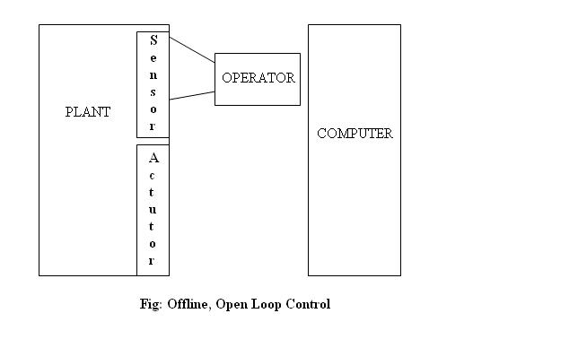
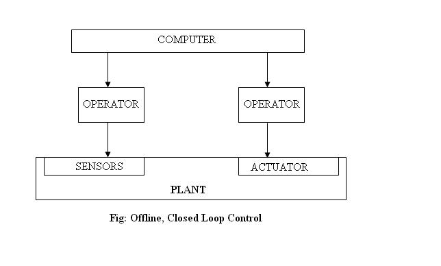
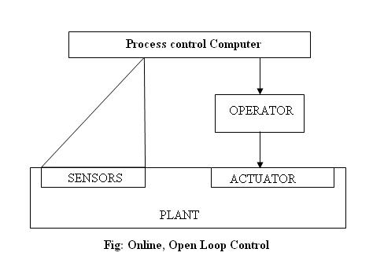
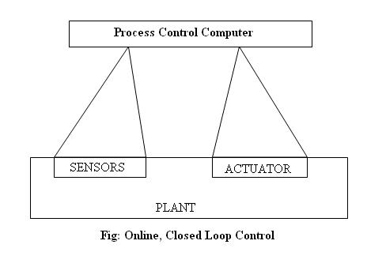
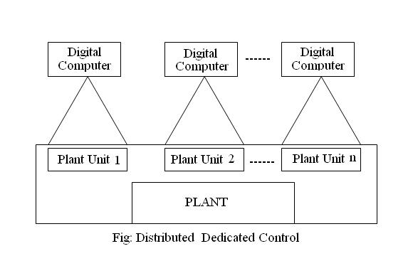
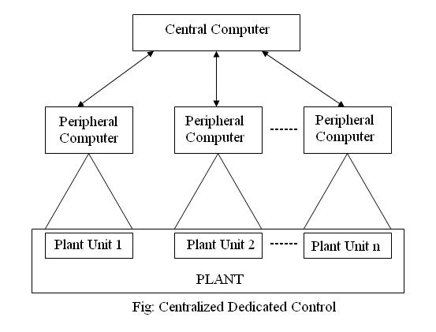
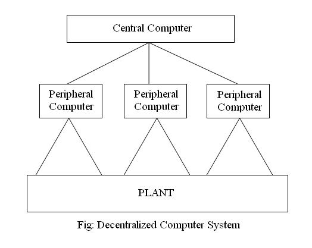
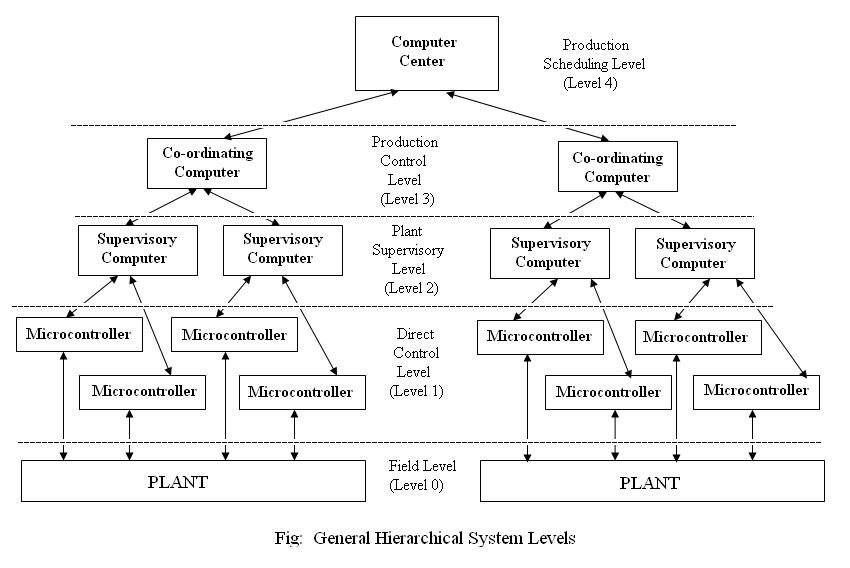
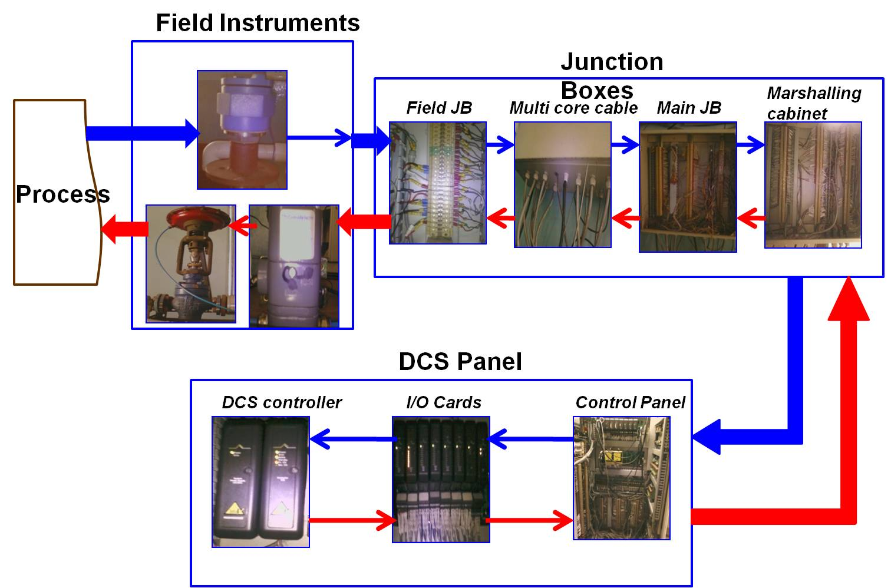

### **Introduction**

In any process plant, the purpose of automation to maintain the product quality, consistency, reduce start-up time, and increase speed of operation with human safety. Control system whether it is a Programmable Logic Controller (PLC) or a Distributed Control System (DCS) is required for the same purpose. The purpose of Industrial automation laboratory is to understand the theory and programming aspects of DCS.

### **Definition**

A Control system which is functionally as well as physically distributed is called Distributed Control System.

### **Evolution of DCS**

The control systems were developed along with the technology and as the difficulties faced by each technology were realized.

#### **1. Open Loop: offline**

In this technology, digital computers were applied for acquisition and processing of plant data/laboratory data or test field data. At this time operator had to read this data and store them, which was an offline process for acquisition and processing of data. No optimization and feedback control.

#### **2. Closed Loop : offline**

In this technology, set point values were calculated by computer but still manually set by plant operator. Thus offline closed loop control was formed. This was only acceptable when timing condition of process control is not severe as manual intervention leads to introduction of time delay in the control of the process.

#### **3. Open Loop : online**

In this era of 50's computers were provided for process interface for data acquisition and process control, by connecting inputs directly to the computer. But still used as open loop control.

#### **4. Closed Loop : online**

At the end of 50's era output elements were also connected to the computers for online process monitoring and control. Thus data transfer in both the directions was the first step towards online closed loop control.

#### **5. Distributed Dedicated Computers**

In the first half of 60's computers were used for dedicated functions i.e. their functions were clearly defined like data processing, data acquisition etc. with no interconnection between them. Data inter-exchange was only possible via a transportable medium.

#### **6. Centralized Dedicated Computers**

The information inter-exchange which was not possible in the distributed dedicated computer control was possible by introducing another central computer in which data from all the dedicated computers is collected, which can be shared later on. This led to the information exchange but with computational speed and reliability of computer at stake.

#### **7. Decentralized Computer System**

In the beginning of the 70's it was accepted that the central computer will solve central automation problem only and peripheral computers have to solve local problems in their close surrounding. A two stage hierarchical automation system structure called Decentralized Computer System was introduced because of this .

### **Architecture and Block Diagram**

Functionally Decentralized or Distributed Control System is divided into four different levels as follows performing the functions as described below:

#### **LEVEL 0: FIELD LEVEL**

As the name suggests this level comprises of the basic field instruments like sensors, transmitters etc. which are directly connected to the process.

#### **LEVEL 1: DIRECT PROCESS CONTROL**

This level handles various functions as:
* Data Acquisition
* Data Check
* Plant Monitoring
* Open and Closed loop Control
* Reporting

#### **LEVEL 2: PLANT SUPERVISORY CONTROL**

This level handles various functions as:
* Plant Performance Monitoring
* Plant Coordination
* Optimal Process Control
* Adaptive Control
* Failure Detections

#### **LEVEL 3: PRODUCTION SCHEDULING AND CONTROL**

This level handles various functions as:
* Production Dispatching
* Inventory Control
* Production Supervision
* Production Re-Scheduling
* Production Reporting

#### **LEVEL 4: PLANT MANAGEMENT**

This level handles various functions as:
* Market and Customer Analysis
* Orders And Sales Statistics
* Capacity and Order Balance
* Order Dispatching
* Production Planning
* Terms Supervision
* Financial Surveys

### **Working of DCS**
The working of DCS can be divided into two parts

#### **1.Hardware Flow**

In any process the sensory organs of a process are sensors and /or transmitters through which the status of the process is known. The flow of signal passes from sensors/ transmitters to a local field junction box where number of wires comes. From field junction box through a multi core cable it goes to the main junction box. Again from main junction box it comes to a marshalling cabinet where the wires enter into the control panel. In the control panel, controller and I/O cards are placed. After signal entering the panel, the signal wire with or without a relay card goes into the input card connected to the controller. Controller thereby processes the data according to the logic created and gives output to the Final Control Element through output cards, following the same route.

#### **2.Software**

There is a scan cycle which needs to be completed for the execution of an instruction needed to control the process. The scan period is set by the user while configuring DCS and the following steps occur for each scan period:
* Firstly the status of inputs from the process through the input cards are checked.
* Then the values are updated in the program and according to the logic prepared by the programmer output values are decided.
* These outputs then go to the field through output cards.
* Moreover the status is updated in the SCADA as well as the changes are stored for future reference in the historian. Any alarms i.e. deviations in the process are there, then they are also noted and stored.

### **Functions of DCS**

* I/O signal characterization
* Signal filtering
* Alarming I/O modules
* Ranging and engineering units
* Control logic
* Control interlocks
* Sequencing
* Batch control
* Passing on trending information
* Passing on report information

### **Performance Evaluation of DCS**

* Available memory for configuration
* Available idle time (based on a given scan rate)
* I/O loading or criticality
* Number of available software addresses for Input/output blocks
* Number of available software addresses for control blocks

### **Internals of DCS**
DCS can be divided into two parts for understanding purpose.

**Hardware:** It consists of the following
* Controller
* Power supply for controller
* I/O Terminal Block
* DIN Rail
* I/O Interface Carrier
* Bulk Power Supply
* System Power Supply
* Server
* Professional Stations
* Operator Stations
* Application Stations
* Remote Workstations
* Relays

**Software:** It consists of the following

* To view and control the process using mimic, same as the real process (SCADA).
* Programming environment wherein logic can be created.
* A hierarchical view of the whole system
* Advance Control Strategy Schemes
* Configuration Suite to configure the hardware attached.
* Diagnostic Suite
* Alarm Module
* History Module
* Trends Module
* Database management module

### **Advantages**

* System implementation can be carried out in a modular fashion due to which system growth can be easily achieved as each processor has clearly defined set of functions; if carefully designed.
* System overloading is less in case of DCS.
* In case of failure of a part, DCS doesn't affect the whole system/ process.
* Backup i.e. redundancy feature possible in DCS.
* Reliability of DCS is more than that of Centralized Control.
* Reduction of cost of interfacing to computer due to reduction in wire usage for control purpose.
* DCS is more flexible in terms of altering configurations within a specified range so as to confrm to the change requirements if any.
* Duplicate storage of critical data can be done easily.
* Independent or standalone processors communicate with each other which make management of computers easy.
* Minimization of data loss as well as errors due to placement of controllers in the nearby vicinity in DCS.
* Advanced control strategies are easy to implement in DCS.

### **Limitations**

* Cost is high when compared with PLC/PC Combination.
* Specialized support from engineering personnel required.
* DCS’s require a clean control room environment compared to PLC/ PC environment.

### **Selection Procedure**

There are number of considerations for selecting a proper automation tool for a particular application
For multiple product manufacturing, varied receipe parameters, multiple procedures, often changes required in receipes, complex batch processes with number of regulatory loops, **DCS** is preferred.
If the operator’s interaction is required to keep process to fulfill target performance, For observing process with faceplates, critical trends, for responding effectively during plant upsets, **DCS** is preferred.
**DCS** gives adjustable scan time, online configuration changes, simple to advanced PID control and advanced process control strategies.

### **Difference Between PLC and DCS**

